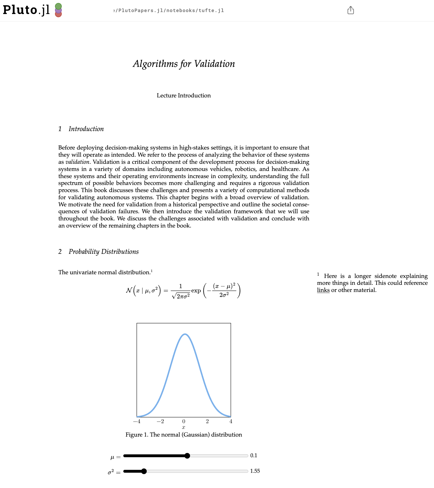
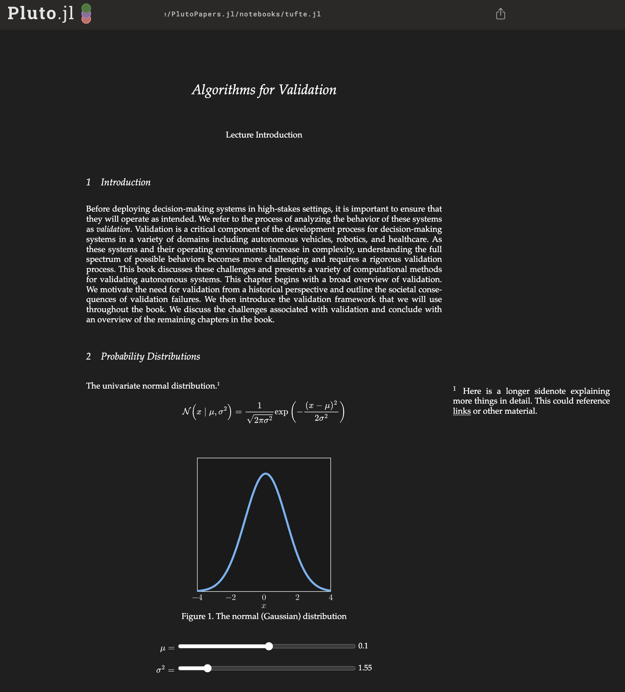
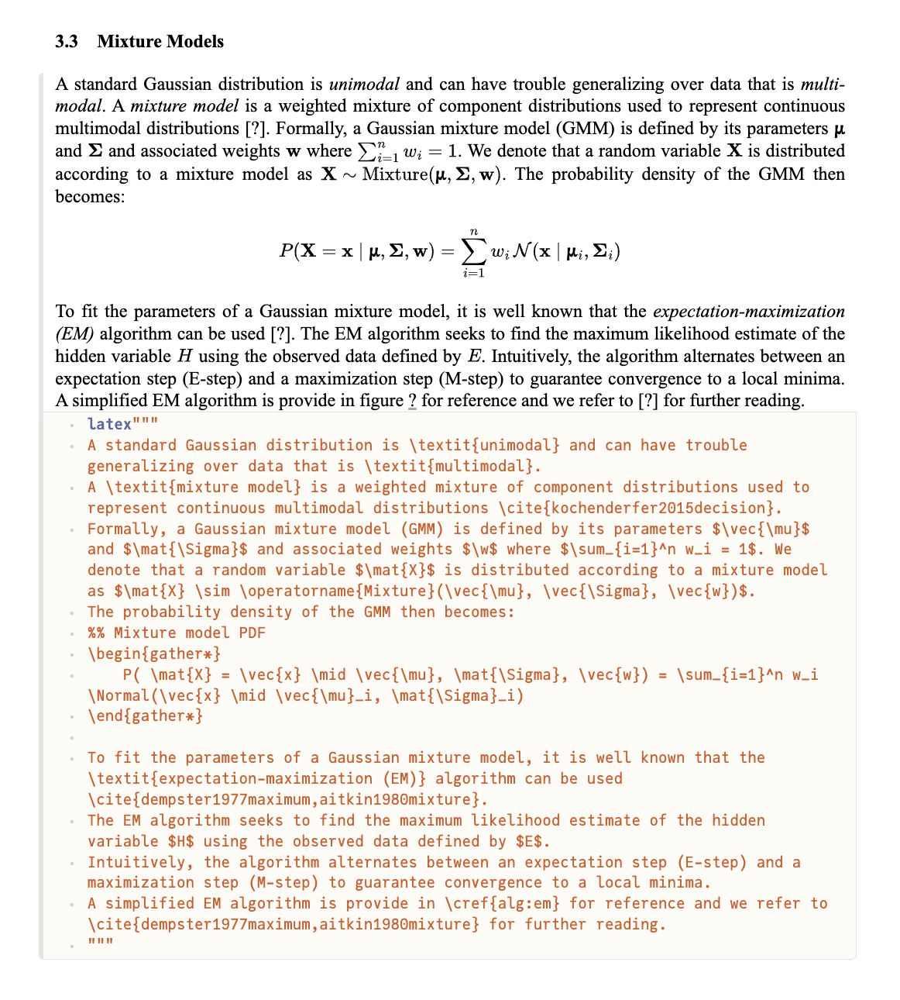

# PlutoPapers.jl

Interactive and $\LaTeX$-styled papers in [Pluto.jl](https://github.com/fonsp/Pluto.jl).

<p align="center">
    <video width="448.5" height="492.5" controls src="./media/tufte.mov" autoplay></video>
</p>

# Installation
```julia-repl
pkg> add https://github.com/mossr/PlutoPapers.jl
```

# Examples

See the following Pluto notebooks for examples.

Example | HTML
:------ | :--:
NeurIPS style paper. | [](https://mossr.github.io/PlutoPapers.jl/html/neurips.html)
Full conversion of $\LaTeX$ paper ([arXiv link](https://arxiv.org/pdf/2009.09043)) | [](https://mossr.github.io/PlutoPapers.jl/html/cem.html)
Tufte-style lecture presentation | [](https://mossr.github.io/PlutoPapers.jl/html/tufte.html)
Probability course notes | [](https://mossr.github.io/PlutoPapers.jl/html/cs109.html)

We also support both light and dark mode papers!

Light Mode | Dark Mode
:---------------:|:----:
<kbd> <a href="./media/tufte-light.png"></a> </kbd> | <kbd> <a href="./media/tufte-dark.png"></a> </kbd>


## Changing document style
Here's an example changing from the preset NeurIPS style to the Tufte style:

<p align="center">
    <video width="448.5" height="492.5" controls src="./media/neurips.mov" autoplay></video>
</p>

## Write mixed Markdown and $\LaTeX$

Using the `latex` string macro, you can write both raw $\LaTeX$ code mixed with Markdown.

<p align="center">
    <a href="./media/latex-macro.png"></a>
</p>

# Contribution

This package is currently in development and pull requests are absolutely welcome!

— [Robert Moss](https://github.com/mossr)